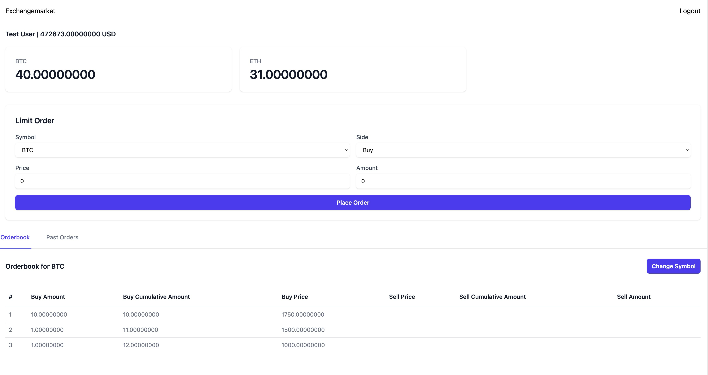

# SawirStudio Order Exchange



## How to run

1. Clone the repository and initial setup

```bash
git clone https://github.com/sawirstudio/orderexchange.git
cd orderexchange
cp .env.example .env
php artisan key:generate
php artisan migrate:fresh --seed
```

2. Fill in necessary environment variables in the .env file, especially the pusher

3. for the best experience, I recommend to use [Herd](https://herd.laravel.com), I also have provided you a herd blueprint file. However, if you use docker, there's also a docker-compose file provided.

4. You can run it using php artisan serve or visit https://orderexchange.sawirstudio.com

Login credentials:

Username: test@example.com
Password: password

5. for testing, you can run it using php artisan test
